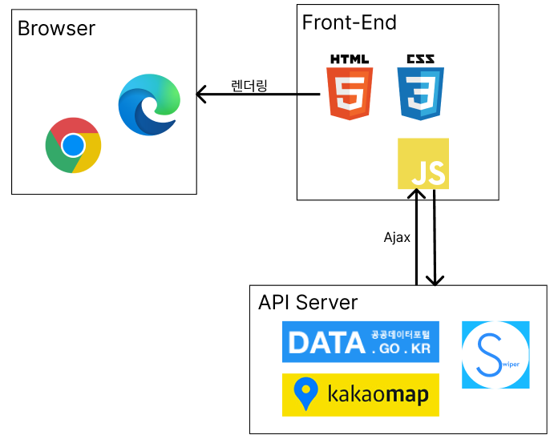
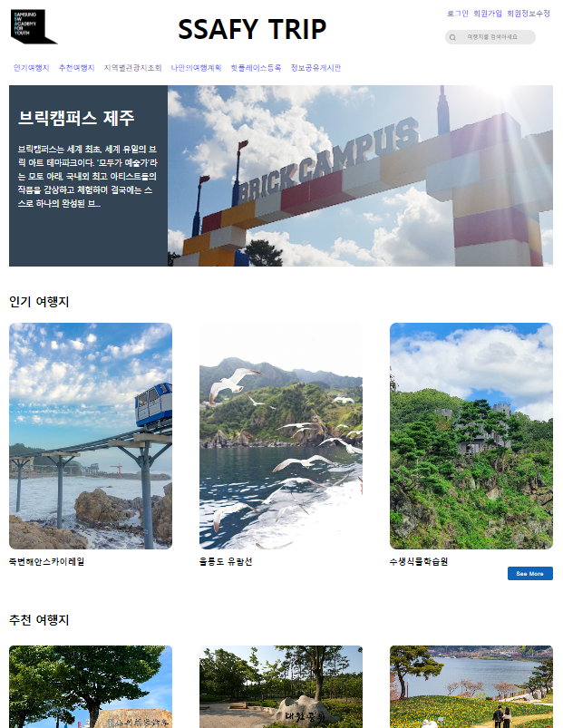
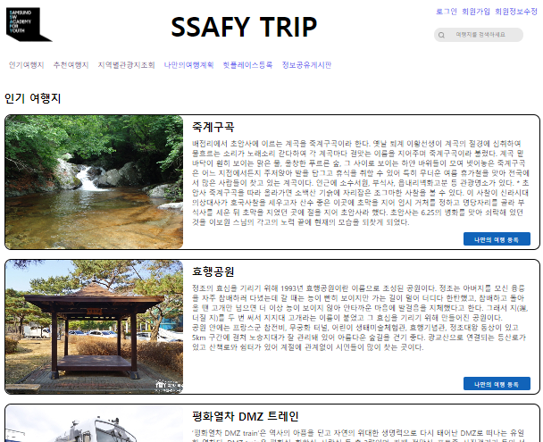
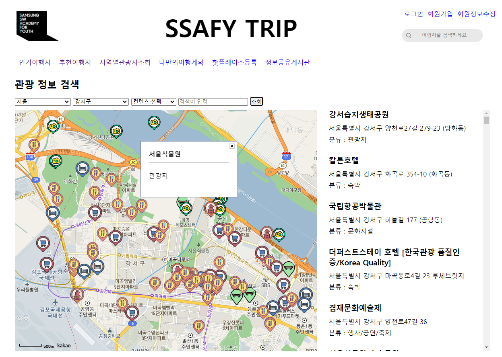
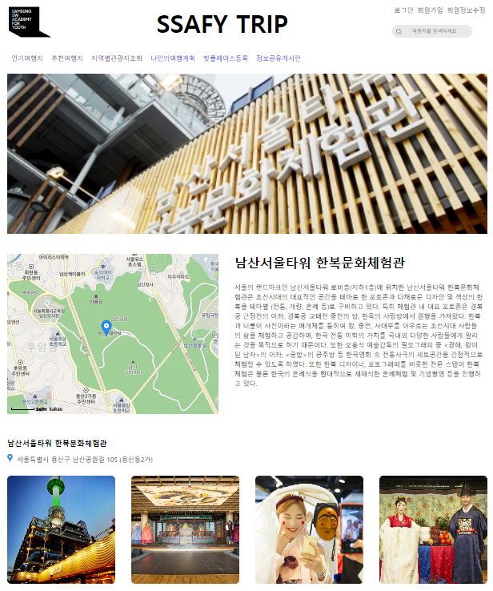
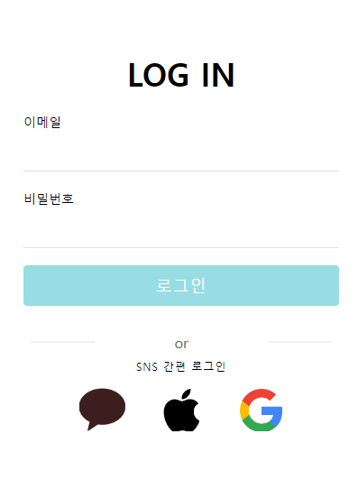
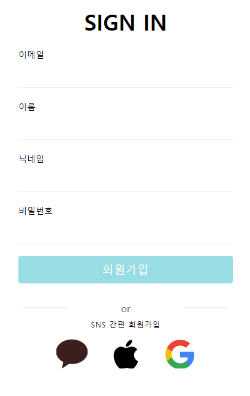
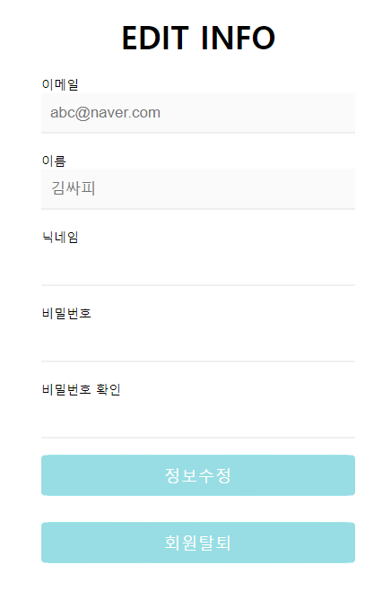

# SSAFY TRIP

### 프로젝트 개요

사용자에게 한국의 다양한 관광지, 먹거리, 축제, 행사, 레포츠, 여행코스 등을 소개하여 지역 관광 활성화를 위한 지역 관광 소개 페이지를 구축한다.

프로젝트의 데이터는 공공데이터포털([https://www.data.go.kr/](https://www.data.go.kr/))에서 한국관광공사에서 제공하는 국문관광정보서비스\_GW를 이용한다.

### 구성원

- SSAFY 9th 대전 6반 송찬환
- SSAFY 9th 대전 6반 최하영

### 개발 환경

**IDE**

- Visual Studio Code (version 1.74 Windows x64)

**사용언어**

- HTML5
- CSS3
- JavaScript

**활용 라이브러리**

- JavaScript Ajax
- Swiper API
- Kakao Map API
- [data.go.kr](http://data.go.kr) - 한국관광공사\_국문 관광정보 서비스\_GW API

**테스트 브라우저**

- Chrome (버전 111.0.5563.65) 64bit
- Microsoft Edge (버전 111.0.1661.41) 64bit

### 프로젝트 구조

**파일 구조**

ssafy_trip

- asset
  - img : image file 위치
    - marker : markerImage file 위치
  - js : javascript file 위치
  - css : stylesheet file 위치
- html : html 파일 위치

---

### 프로젝트 기능별 화면

**메인 화면 (index.html)**

- Swiper로 상단 배너를 구현 (3개의 슬라이드가 3초에 한번씩 슬라이드)
- Header의 로고 클릭시 index.html로 이동, 우측헤더에 검색창 배치
- 네이게이션 바를 헤더 아래에 위치

---

---

**인기, 추천 여행지 목록 (list.html)**

- 인기여행지와 추천여행지의 목록을 나열하는 페이지
  - 각 탭은 같은 페이지를 사용하며, 파라미터에 따라 상단 제목이 달라진다.

---

---

**지역별관광지조회 (search-info.html)**

- 관광지 정보 조회 페이지
- 지역, 구/군, 컨텐츠, 검색어를 통해 검색할 수 있으며, 검색된 결과가 지도에 마커로 표시도록 구현
- 오른쪽 리스트의 각 항목을 클릭했을 때 해당 위치로 지도가 이동한다.

---

---

**상세정보조회 (detail.html)**

- 관광지 목록을 클릭시 상세 정보 조회 페이지로 이동할 수 있다.
  - 상단 메인 배너에 대표이미지가 위치
  - 중단에 지도와 선택관광지의 설명
  - 하단에 주소와 이 관광지에서의 활용이미지 여러장이 위치

---

---

**로그인, 회원가입, 회원정보수정 (signin.html, signup.html, usreinfo.html)**

